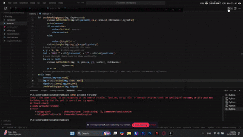

# 🚗 Parking Space Detection System

  

A computer vision-based parking space detection system that automatically identifies occupied and free parking spots in real-time using OpenCV and Python.

## 📋 Overview

This project uses video processing and edge detection to analyze parking areas and determine which spaces are available. The system displays green rectangles for free spaces and red rectangles for occupied ones, with a real-time counter showing the number of available spaces.

## ✨ Features

- **Interactive Parking Space Mapping**: Use the picker tool to mark parking spaces
- **Real-time Detection**: Analyzes video feed to detect free/occupied spaces
- **Visual Indicators**: 
  - 🟢 Green rectangles = Free parking spaces
  - 🔴 Red rectangles = Occupied parking spaces
- **Live Counter**: Displays "FREE X/Y" showing available spaces vertically
- **Edge Detection**: Uses Canny edge detection for accurate space analysis

## 🛠️ Technologies Used

- Python 3.x
- OpenCV (cv2)
- cvzone
- Pickle
- NumPy

## 📦 Installation

1. Clone the repository:
```bash
git clone https://github.com/yourusername/Parking.git
cd Parking
```

2. Install required dependencies:
```bash
pip install opencv-python cvzone
```

## 🚀 Usage

### Step 1: Mark Parking Spaces

First, run the picker tool to mark all parking spaces on your video:

```bash
python picker.py
```

**How to use the picker:**
- **Left Click**: Add a parking space at the clicked position
- **Middle Click**: Remove the last added parking space
- **Press 'q'**: Quit and save the positions

The parking space positions will be saved in the `placesPosition` file.

### Step 2: Run Detection

Run the main detection script:

```bash
python main.py
```

**Controls:**
- The program will display the video with detection overlay
- **Press 'q'**: Quit the application

## 📁 Project Structure

```
Parking/
├── main.py              # Main detection script
├── picker.py            # Tool to mark parking spaces
├── placesPosition       # Saved parking space coordinates
├── parking.mp4          # Video file for analysis
└── README.md            # Project documentation
```

## 🎯 How It Works

1. **Space Marking**: The picker tool allows users to click on each parking space to record its coordinates
2. **Edge Detection**: The main script uses Canny edge detection to identify edges in the video frames
3. **Space Analysis**: Each marked space is analyzed by counting non-zero pixels (edges) within that region
4. **Occupancy Determination**: 
   - If edge pixels < 700: Space is **FREE** (green)
   - If edge pixels ≥ 700: Space is **OCCUPIED** (red)
5. **Visual Display**: The system draws rectangles and displays the count in real-time

## ⚙️ Configuration

You can adjust the detection sensitivity in `main.py`:

```python
if pxcount < 700:  # Adjust this threshold value
    color = (0, 255, 0)  # Green for free
else:
    color = (0, 0, 255)  # Red for occupied
```

- **Lower values** (e.g., 500): More sensitive, may show false occupied
- **Higher values** (e.g., 900): Less sensitive, may show false free

## 🎨 Customization

- Change parking space size in both files: `w, h = 50, 100`
- Modify video source path on line 6 of `main.py`
- Adjust text position and style in the display section

## 📝 Notes

- Ensure good lighting conditions in the video for better detection accuracy
- Parked vehicles should have clear edges for optimal results
- The threshold value (700) may need adjustment based on your specific video characteristics

## 🤝 Contributing

Contributions are welcome! Feel free to fork this repository and submit pull requests.

## 📄 License

This project is open source and available for personal and educational use.

## 👤 Author

Created with ❤️ for efficient parking management

